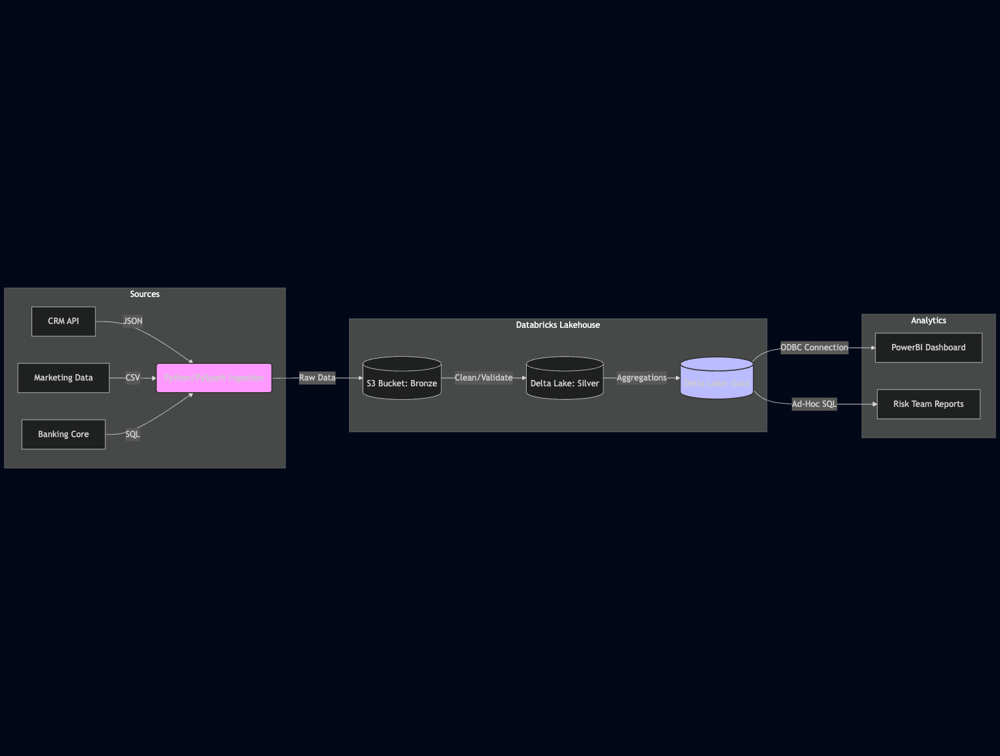
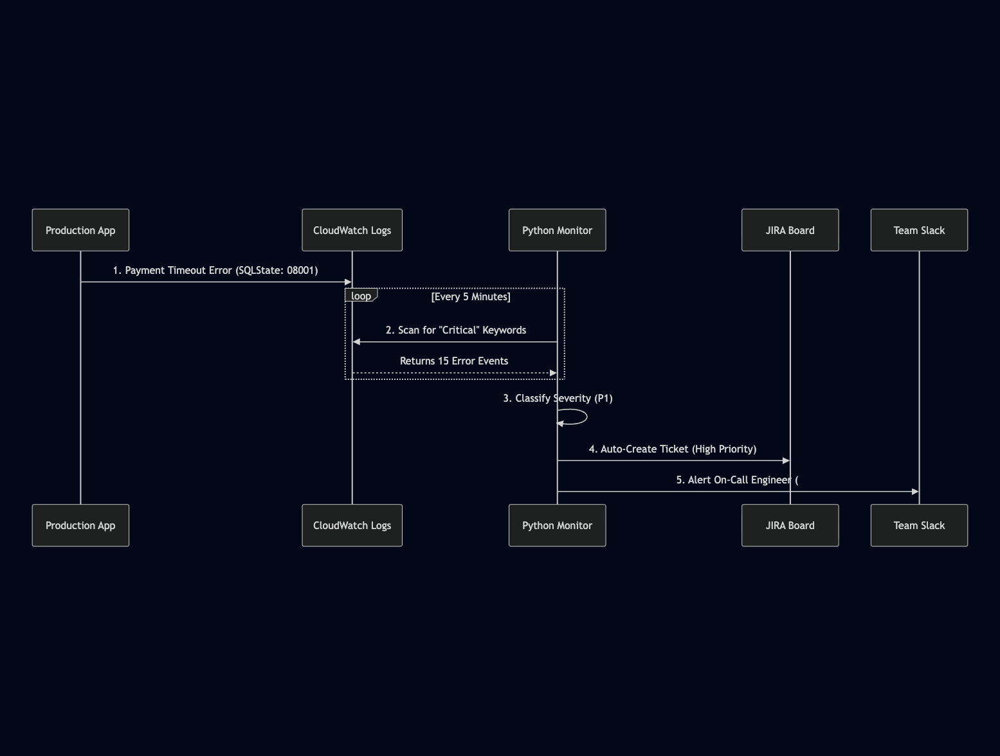

---

## 👋 About Me
I am a Data Integration Analyst (Engineering Focused) with 3+ years of experience in FinTech (Flexiti, Questrade), bridging the gap between Data Engineering and System Reliability.

I don't just build pipelines; I ensure they stay up. I specialize in the **Modern Data Stack** (Databricks, Python, SQL) and have a strong focus on **Incident Response** and **Automated Data Quality**.

**Core Stack:** Python (Pandas/Boto3), Databricks (Lakehouse), SQL, AWS.

---

## 🛠️ Key Projects

### 1. Enterprise Financial Data Lake Integration
**The Problem:**
Financial data was siloed across three different legacy systems (CRM, Marketing, Core Banking), requiring manual extraction that delayed reporting by 48 hours.

**The Solution:**
I architected a **Databricks Lakehouse** solution to unify these sources into a "Single Source of Truth."
* **Ingestion:** Python scripts (running on Databricks Jobs) fetch data via REST APIs.
* **Storage:** Raw data is stored in AWS S3 (Delta Lake format) for ACID compliance.
* **Quality:** Automated "Great Expectations" checks run pre-ingestion to reject bad data.

**The Architecture:**

**The Workflow:**

**The Result:**
> ⚡ **Reduced processing time by 30%**
> 📉 **Eliminated manual file transfers completely**
> 🟢 **Achieved 99.9% uptime for critical financial reporting**
---
### 2. Automated Incident Response System
**The Problem:**
SQL timeouts and payment gateway errors were creating "operational noise," requiring manual triage that distracted the engineering team.

**The Solution:**
Built an automated monitoring framework using **Python** and **CloudWatch/Datadog**.
* Scripts parse logs for specific error patterns (e.g., `SQLState: 08001`).
* Auto-classification of severity (P1 vs P3).
* Automatic ticket creation in JIRA with relevant stack traces attached.

**The Result:**
> **Reduced Mean Time to Detection (MTTD) from hours to minutes.**
> **Allowed the team to focus on root cause fixes rather than triage.**

---

## 📜 Certifications
* **Databricks Certified Data Engineer Associate**
* **Databricks Certified Data Analyst Associate**
* **GCP Databricks Platform Architect**

---

## 🚀 Experience Snippets
* **Flexiti (Questrade Group):** Migrated legacy SQL procedures to PySpark, optimizing runtime by 30%.
* **KUBRA:** Managed client-facing production incidents, ensuring SLAs were met for high-volume payment systems.

---
